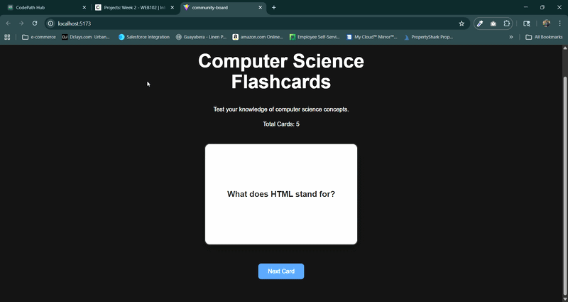

# Web Development Project 2 - Computer Science Flashcards

Submitted by: **Jean-Marie St Hilaire**

This web app: **A flashcard application that tests users on core Computer Science concepts by alternating between questions and answers on click.**

Time spent: **8** hours spent in total

## Required Features

The following **required** functionality is completed:

- [x] **The app displays the title of the card set, a short description, and the total number of cards**
  - [x] Title of card set is displayed 
  - [x] A short description of the card set is displayed 
  - [x] A list of card pairs is created
  - [x] The total number of cards in the set is displayed 
  - [x] Card set is represented as a list of card pairs
- [x] **A single card at a time is displayed**
  - [x] Only one half of the information pair is displayed at a time
- [x] **Clicking on the card flips the card over, showing the corresponding component of the information pair**
  - [x] Clicking on a card alternates the view, showing the back with corresponding information 
  - [x] Clicking it again alternates it back to the front
- [x] **Clicking on the next button displays a random new card**

The following **optional** features are implemented:

- [ ] Cards contain images in addition to or in place of text
- [ ] Cards have different visual styles such as color based on their category

The following **additional** features are implemented:

* [ ] List anything else that you added to improve the site's functionality!

## Video Walkthrough

Here's a walkthrough of implemented required features:

GIF created with **ScreenToGif**

## Notes

Describe any challenges encountered while building the app:
* **Conditional Rendering:** I implemented a state toggle so that clicking the card alternates between the question and answer text.
* **Navigation:** Set up a randomization function to pull a new card object from the array when the user clicks the "Next" button.

## License

    Copyright 2026 Jean-Marie St Hilaire

    Licensed under the Apache License, Version 2.0 (the "License");
    you may not use this file except in compliance with the License.
    You may obtain a copy of the License at

        http://www.apache.org

    Unless required by applicable law or agreed to in writing, software
    distributed under the License is distributed on an "AS IS" BASIS,
    WITHOUT WARRANTIES OR CONDITIONS OF ANY KIND, either express or implied.
    See the License for the specific language governing permissions and
    limitations under the License.
